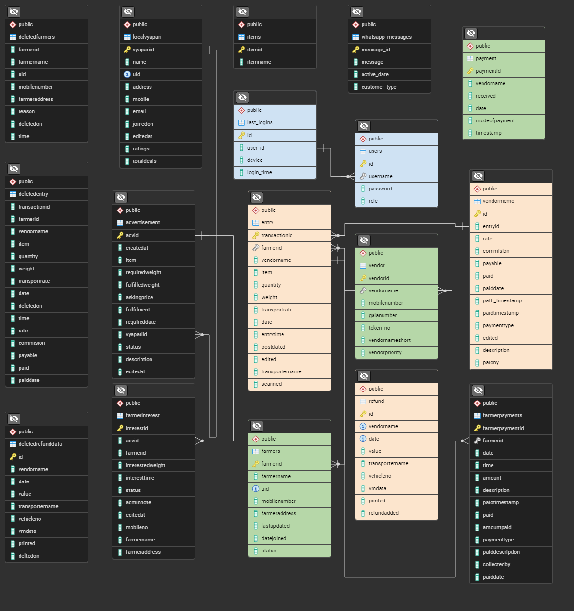

Please contribute 😢

# HHG ERP

This project is an ERP web application designed for middlemen who facilitate the transportation and sale of agricultural produce between farmers and vendors in rural India. The application digitizes traditional manual processes, simplifying the tracking of daily entries, cash flow, and the movement of produce. It uses **Next.js** for the frontend and **PostgreSQL** for the backend to provide a robust platform for managing receipts, inventory, and payments.

# Getting Started

To set up and run the project, follow these steps:

## Prerequisites

-   [Node.js](https://nodejs.org) installed
-   [Docker](https://www.docker.com) installed
-   [Git](https://git-scm.com) installed

## Installation

1. Clone the repository:

```

git clone git@github.com:kuldeepaher01/hhg-erp.git

cd hhg-erp

pnpm install

```

  

2. **Database Setup**: Use the provided script to set up the PostgreSQL database in a Docker container.

  

For Windows (PowerShell):

```

.\db_setup.ps1

```

  

If you encounter an error about running scripts being disabled, you may need to change the execution policy. 

```

Set-ExecutionPolicy -Scope Process -ExecutionPolicy Bypass

```

Then run the script again:

```

.\db_setup.ps1

```

  


For Linux/macOS:

```

chmod +x db_setup.sh

./db_setup.sh

```
-   This script will:
    
    -   Create a Docker volume for data persistence.
    -   Build and run the PostgreSQL Docker container.
-   **Database Connection**: The PostgreSQL database will be running with the following details:
    
    -   **Host**: localhost
    -   **Port**: 5433
    -   **Database**: hhg
    -   **User**: hhg_owner
    -   **Password**: VerySecurePassword69

  


## Notes

-   The `DATABASE_URL` is pre-configured in the `.env` file.
-   The database schema and sample data are loaded on the first run via the `init.sql` file.
-   Data persistence is handled via Docker volumes.

To stop the database container:

- To stop the Docker container, run: `docker stop hhg-postgres-container`

- To start it again, run: `docker start hhg-postgres-container`

  

## Resetting the Database

  

If you need to reset the database to its initial state:

  

1. Stop and remove the existing container:

```

docker stop hhg-postgres-container

docker rm hhg-postgres-container

```

  

2. Remove the Docker volume: `docker volume rm hhg-postgres-data`

  

3. Run the setup script again to create a fresh instance.

  
  
  

# Project Overview

  

Congratulations on your setup! 
This application utilizes **NextAuth.js** for authentication using a custom client provider connected to our PostgreSQL database. Here’s everything you need to know to get started:

  

## Authentication

  

-  Login Credentials are created are automatically in docker and if you run `init.sql`  locally using psql (docker is recommended)
- Password for all the users is: `admin@123`
- You can create a new user by going to `\createUser` . Before doing this you will need to login or you can comment the `line no 10`  in `src\middleware.js`.
- bcrypt is used so you cannot see the password in database.


## Role-Based Access

  

The application employs role-based access controls:

  

-  **Admin:** Full access to all features.

-  **User & Guest:** Limited permissions.

  - You can see this in **users** table in the database.


## Project flow

  
### 1. Setting Up Vendors and Farmers

  

To kick things off, make sure your docker container is running:

  

- Navigate to the */entry* or */viewentries* routes to see the entries that we setup using the `init.sql` .

- It sets up vendors, farmers, users, entries and refund. Which is enough to get you started. Read the flow to understand what page does what.

  

### 2. Managing Entries

  

#### Entry Page

  

-  **Function:** This is the main interface for recording new produce entries.

-  **Steps:**

- Select a **Date:** When a farmer brings in produce, select the date.

-  **Farmer Identification:** Enter the farmer’s UID or Name to fetch their details (UID, Name, Mobile Number).

-  **Vendor Details:** Specify the vendor name, number of bags, type of produce (Beans, Cauliflower, Tomato, Potato), and the total weight.

-  **Print:** After submitting, a print window will open for sticker printing (25mm x 30mm), including an extra sticker for the farmer’s acknowledgment.

-  **Recent Entries:** Displays the last successful entry and the last five entries for quick reference.

  

#### View Entries

  

-  **Function:** View and manage all entries for the selected day.

-  **Steps:**

- Change the date using a date picker.

- Entries can be deleted (which moves them to a different table) or edited as needed.

  

### 3. Transporter Memo

  

-  **Function:** Summarizes the number of bags and freight to be collected based on vendor data.

-  **Steps:**

- Click on a vendor name to be redirected to the **Vendor-Transport Memo** page for detailed entry management.

  

### 4. Vendor-Transport Memo

  

-  **Function:** Captures daily entry details for a specific vendor.

-  **Steps:**

- Automatically calculates transport rates based on weight (20-90 kg). For weights outside this range, manual input is required.

- Transport rate is approximately calculated as `weight x 2`.

- Refund amounts (usually `quantity x 10`) are tracked here.

  

-  Transporter Details are also recorded for the day’s memo.
- Enter the transporter’s name and vehicle number for that day’s memo only; these details will auto-fill for subsequent memos.

- Only modified rows are updated in the database when saving.

  

### 5. Printing Functionality

  

-  **Function:** Allows users to print entry records.

-  **Steps:**

- After saving your entries, you’ll be redirected to a print page for your records.

  

### 6. Vendor Memo Pages

  

-  **Pending Vendor Memos (`/vmdata`):**

-  **Function:** Displays all pending vendor memos.

-  **Steps:** Click on a row to access the specific vendor's memo page.

-  **Monetary Details (`/vendormemo`):**

-  **Function:** Displays financial transactions for vendors.

-  **Steps:** Enter receipts manually when vendors sell produce. Refunds are pulled from the Vendor-Transporter Memo, and only changed rows are sent to the database upon saving.
(If you setup the project using docker then this data doesn't exist, enter it manually for testing as it requires entry.id so cannot be setup using init)

  

### 7. Finding Farmer Data

  

-  **Function:** Search and view farmer transaction histories.

-  **Steps:**

- Search for farmers and view their history, including produce brought, selling prices, and payment status.

- Payments marked as disbursed are recorded, along with who marked them.

  

### 8. Daily Payment Book (`/dailybook`)

  

-  **Function:** Summarizes payments made to farmers.

-  **Steps:** Displays all relevant details regarding disbursed payments.

  

## Vendor Menu

  

-  **Add New Vendor:**

-  **Function:** Allows for adding new vendors.

-  **Add Vendor Payment:**

-  **Function:** Track payments sent to HHG Enterprise by vendors.

  

-  **Vendor Statement:**

-  **Function:** Displays a summary of a selected vendor’s financial transactions over a specified period.

  

## Farmer Menu

  

-  **Add New Farmer:**

-  **Function:** Input required farmer details.

-  **Steps:** UID is essential for easy identification.

  

-  **Add Advance:**

-  **Function:** Record any advance payments made to farmers.

  

-  **View All Farmers:**

-  **Function:** View, update, and delete farmer records.

  

## Reports

  

-  **Daily Market Rate:**

-  **Function:** View and print per kg rates for items, organized by date.

  

-  **Daily Summary:**

-  **Function:** A dashboard summarizing overall income, data, and top farmers.

  

-  **Daily Payment Book:**

-  **Function:** Previously explained, displays daily payment summaries.

  

## Additional Features

  

-  **Extras:**

-  **Function:** The **Refresh Daily Rate** function updates the materialized view used in a client application.

-  **Add Late Entries:**

-  **Function:** Quickly add entries if they need to be recorded after other transport rates have been applied.

  

---

  
<!-- Show docs/db_schema.png -->



In the schema above, you can see the database structure for the project. The tables are interconnected to store and manage data efficiently.
- Orange colored tables are the main tables that store the project's core data.
- Green colored tables are the tables that store the project's vendors and farmers.
- Blue colored tables are the tables that store the project's login related data.
- Black colored tables are miscellaneous tables, which are not directly related to the project's main functionality.


If you have any questions or need clarification on any features, feel free to reach out. We’re here to help you make valuable contributions!


<!-- add contribution  -->

# Contributing

We welcome contributions from the community! To get started, please read our [Contributing Guidelines](CONTRIBUTING.md) to learn more about our development process, coding standards, and how to set up the project on your local machine.

# License

This project is licensed under the MIT License - see the [LICENSE](LICENSE) file for details.

# Code of Conduct

We expect contributors to adhere to our [Code of Conduct](CODE_OF_CONDUCT.md). Please read the guidelines carefully before making any contributions.

# Maintainers

- Kuldeep Aher [kuldeepaher01](https://github.com/kuldeepaher01)
- Aryan Pokharkar [aryanp86](https://github.com/aryanp-86)
- Siddhesh Patil [siddheshp27](https://github.com/siddheshp27)


